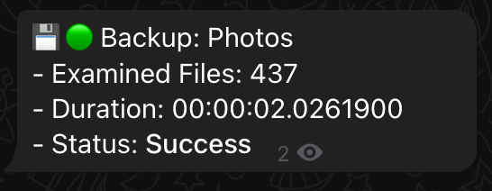
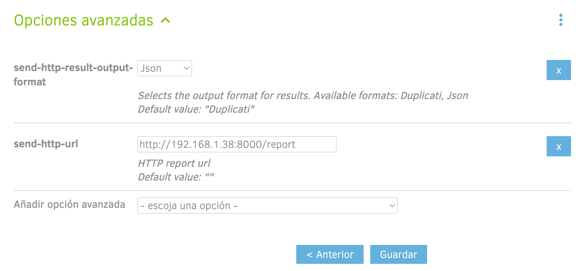

# Duplicati Monitor

Duplicati Monitor is a docker-packaged monitoring solution for Duplicati.

It allows you to control the status of your backups and statistics for each report and notifies you by any means supported by **Apprice**. It is meant to be self-hosted and powered by docker.


## Quick Start

### Notifications

To send notifications and satisfy the end user, it has been implemented with the Apprise library, which allows you to send a notification to almost all the most popular notification services available today, such as: Telegram, Discord, Slack, Amazon SNS, Gotify, etc.

You can check all the services available in the [official documentation](https://github.com/caronc/apprise#productivity-based-notifications).

### Templates

You can create your own templates to receive the information you exactly need.

By default we use the following two:

    # Succes backup
    💾 🟢 <Extra.backup-name>

    # Error backup 
    💾 🔴 <Extra.backup-name>


You can create your own templates in a simple way. You only have to use the symbols `<` and `>` delimit the fields and separating keys with dots `.` to send along with the message that you want.

In the [docs/examples_report](docs/examples_report) folder of this repository you have two examples of the JSON reports that Duplicati sends and in which you can see the fields that compose it.

For example, with the following template, the result shown in the telegram image would be obtained.

    💾 🟢 Backup: <Extra.backup-name>\n - Examined Files: <Data.ExaminedFiles>\n - Duration: <Data.Duration>\n - Status: *<Data.TestResults.ParsedResult>*



### Environment Variables

| ENVIRONMENT VARIABLE | TYPE | DEFAULT | DESCRIPTION|
|--|--|--|--|
| `URI_NOTIFICATION` | required | | URI in Apprise format where the notifications will be sent.|
| `TEMPLATE_SUCCESS`| opcional | 💾 🟢 <Extra.backup-name> |Message template to be sent when the backup is successful.|
| `TEMPLATE_ERROR` | opcional | 💾 🔴 <Extra.backup-name> | Message template that will be sent when the backup is executed in an erroneous way.|
| `PORT` | opcional | 8000 | Listening port on which the service is set up to receive the reports.|

### Docker Run

To start the container you can do it with the following command.

    docker run -d --name=duplicati-monitor -p 8000:8000 -e URI_NOTIFICATION=tgram://<TOKEN_TELEGRAM_BOT>/<CHANEL_ID>/?format=markdown rafa93m/duplicati-monitor

Or you can also use the following docker compose.

``` yaml
version: "3"
services:
    duplicati-monitor:
        container_name: duplicati-monitor
        image: rafa93m/duplicati-monitor
        ports:
            - 8000:8000
        environment:
            URI_NOTIFICATION: "tgram://<TOKEN_TELEGRAM_BOT>/<CHANEL_ID>/?format=markdown"
            TEMPLATE_SUCCESS: "💾 🟢 Backup: <Extra.backup-name>"
            TEMPLATE_ERROR: "💾 🔴 Backup <Extra.backup-name> failed 🔥 🔥"
        restart: unless-stopped
```

### Setup Duplicati

Add theses two options for each backup you want to monitor:

- **send-http-result-output-format**: json
- **send-http-url**: http://**IP_ADDRESS**:**PORT**/report

